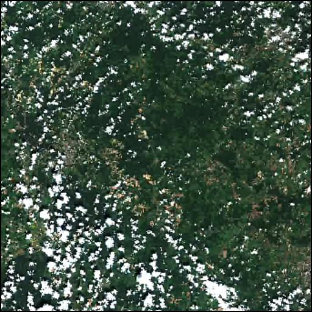
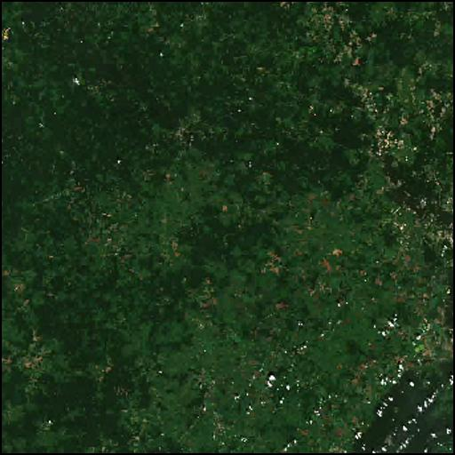

# Приложение для выдачи спутниковых снимков с Copernicus HUB

---

### Запрос доступных снимков по параметрам

Данное приложение позволяет выполнять поиск и загрузку спутниковых снимков с сервиса Copernicus Open Access Hub. Взаимодействие происходит при помощи http запросов к серверу приложения.

Для того, чтобы получить список доступных снимков, необходимо направить POST запрос на URL `/regions`. Тело данного запроса должно содержать в себе данные в формате GeoJSON, где в разделе properties будет находиться параметр `cloud`, содержащий в себе желаемый диапазон облачности на запрашиваемых снимках, а также параметр `date`, содержащий в себе диапазон дат запрашиваемых снимков. В поле `geometry` произвести подстановку координат запрашиваемой области.

```
{
  "type": "FeatureCollection",
  "features": [
    {
      "type": "Feature",
      "properties": {
          "cloud": [
              0, 20
          ],
          "date": [
              "20220109", "20220710"
           ]
      },
      "geometry": {
        "type": "Polygon",
        "coordinates": [
          [
            [
              36.22913360595703,
              54.494371163405575
            ],
            [
              36.29951477050781,
              54.494371163405575
            ],
            [
              36.29951477050781,
              54.53363330399915
            ],
            [
              36.22913360595703,
              54.53363330399915
            ],
            [
              36.22913360595703,
              54.494371163405575
            ]
          ]
        ]
      }
    }
  ]
}
```

Чтобы сгенерировать файл формата GEOJson, можно воспользоваться [данным](http://geojson.io) сервисом. После определения области интереса, будет сгенерирован необходимый текст, в который необходимо добавить параметры `cloud` и `date`.

После отправки запроса, в адрес клиента будет направлен список соответствующих снимков в виде параметров, таких как дата `date`, имя `name`, идентификатор `uuid`, а также ссылка на просмотр превью `preview_url` и ссылка на загрузку изображения `download_url`.

```
{
    "date": "Thu, 30 Jun 2022 13:14:15 GMT",
    "download_url": "http://localhost:1060//download/66eb8ec2-b947-4bf1-8506-08b999bd771a/S2A_MSIL2A_20220630T083611_N0400_R064_T36UXF_20220630T131415/L2A_T36UXF_A036669_20220630T083613/T36UXF_20220630T083611",
    "name": "S2A_MSIL2A_20220630T083611_N0400_R064_T36UXF_20220630T131415",
    "preview_url": "http://localhost:1060//preview/66eb8ec2-b947-4bf1-8506-08b999bd771a",
    "uuid": "66eb8ec2-b947-4bf1-8506-08b999bd771a"
}
```
---

### Получение снимков
Для того, чтобы произвести предварительную оценку снимка, необходимо перейти по `preview_url`. В открывшемся окне появится сжатая версия запрошенного снимка. Примеры превью представлены ниже.



В случае, если снимок удовлетворяет требованиям пользователя, возможно произвести загрузку полноценного изображения в формате ***.tif*** с проекцией _EPSG:3857_ (Псевдо-Меркатор). Для этого необходимо перейти по `download_url`. Через некоторое время после перехода на страницу по запрашиваемому _url_, клиенту будет предложена загрузка данного изображения.
